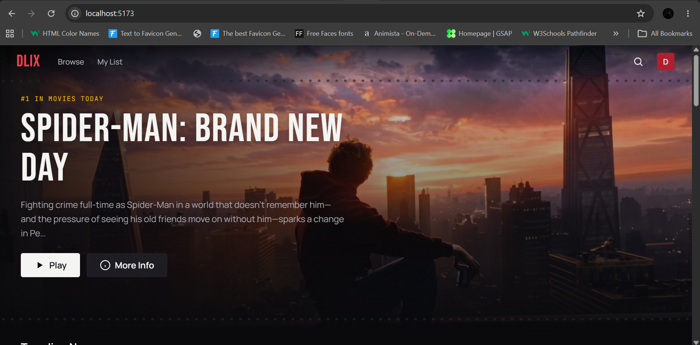

# DLIX

DLIX is a responsive movie-discovery single-page app with a streaming-style interface. Authenticated users can browse curated TMDB collections, search movies, open title details, and play an available YouTube trailer without leaving the app.



## Highlights

- Firebase Authentication with email/password account creation, sign-in, Google popup sign-in, session persistence, and sign-out
- Protected browsing route: unauthenticated visitors are redirected to `/login`
- A rotating hero chosen from the day’s TMDB trending movies
- Scrollable rows for Trending Now, Top Rated, Action Thrillers, Comedies, Horror, Romance, and Documentaries
- Debounced movie search (350 ms) backed by TMDB
- Title detail modal with poster/backdrop, synopsis, rating, release year, runtime, genres, and top-billed cast
- In-app YouTube trailer player when TMDB returns an eligible trailer
- Mobile-friendly layout, keyboard-accessible controls, loading placeholders, lazy-loaded poster images, and an Escape-key modal close action
- Custom cinematic visual system built with Tailwind CSS v4: dark palette, film-grain overlay, and film-strip dividers

## Technology

| Area | Used in DLIX |
| --- | --- |
| UI | React 19 and React Router 7 |
| Build tooling | Vite 8 |
| Styling | Tailwind CSS 4 via the Vite plugin, plus custom CSS tokens/utilities |
| Authentication | Firebase Authentication |
| Movie data | The Movie Database (TMDB) v3 API |
| HTTP client | Axios |
| Quality checks | Oxlint |

## Requirements

- Node.js 20.19+ or 22.12+ (compatible with Vite 8)
- A Firebase project with Email/Password authentication enabled
- A Firebase project with Google sign-in enabled if Google login is desired
- A TMDB API Read Access Token

## Getting started

1. Clone the repository and enter its directory.

   ```bash
   git clone <repository-url>
   cd dlix
   ```

2. Install dependencies.

   ```bash
   npm install
   ```

3. Create a `.env` file at the project root. This file is ignored by Git and must not be committed.

   ```env
   VITE_TMDB_READ_ACCESS_TOKEN=your_tmdb_v4_read_access_token

   VITE_FIREBASE_API_KEY=your_firebase_api_key
   VITE_FIREBASE_AUTH_DOMAIN=your-project.firebaseapp.com
   VITE_FIREBASE_PROJECT_ID=your-project-id
   VITE_FIREBASE_STORAGE_BUCKET=your-project.appspot.com
   VITE_FIREBASE_MESSAGING_SENDER_ID=your_sender_id
   VITE_FIREBASE_APP_ID=your_app_id
   ```

   `VITE_FIREBASE_MEASUREMENT_ID` may be present in Firebase’s config output, but DLIX does not currently use it.

4. Start the development server.

   ```bash
   npm run dev
   ```

5. Open the local URL printed by Vite (normally `http://localhost:5173`). Create an account, sign in, or use Google sign-in if it has been configured.

## Service configuration

### TMDB

Create an account at [TMDB](https://www.themoviedb.org/), request API access, and copy the **API Read Access Token** into `VITE_TMDB_READ_ACCESS_TOKEN`. The app sends it as a Bearer token to `https://api.themoviedb.org/3`.

The app uses these TMDB endpoints:

- `GET /trending/movie/day` for the hero
- `GET /trending/movie/week` and `GET /movie/top_rated` for collections
- `GET /discover/movie` with genre IDs for genre rows
- `GET /search/movie` for title search
- `GET /movie/{id}?append_to_response=videos,credits` for the detail modal

TMDB images are served from `https://image.tmdb.org/t/p/`; trailers are embedded from YouTube only when TMDB supplies a YouTube video whose type is `Trailer`.

### Firebase Authentication

In the Firebase console, register a web app and copy its configuration values into the matching environment variables above. Enable the following providers under **Authentication → Sign-in method**:

- Email/Password
- Google (optional, but required for the **Continue with Google** button to succeed)

For deployed environments, add the site’s domain to Firebase Authentication’s authorized domains. Localhost is usually authorized by default.

## Available commands

| Command | Purpose |
| --- | --- |
| `npm run dev` | Run the Vite development server with hot reload. |
| `npm run build` | Create an optimized production bundle in `dist/`. |
| `npm run preview` | Serve the production bundle locally after building. |
| `npm run lint` | Run Oxlint over the project. |

## Application behavior

### Routes

| Route | Access | Behavior |
| --- | --- | --- |
| `/login` | Public | Presents sign-in, sign-up, and Google sign-in flows. |
| `/` | Authenticated users | Shows the browse experience. |
| Any other path | — | Redirects to `/`; unauthenticated users then land on `/login`. |

### Browse experience

The navbar becomes opaque after scrolling, exposes a delayed search field, and shows a profile menu with the signed-in user’s name/email and a sign-out control. While a non-empty search query is active, the hero and category rows are replaced by a result grid.

Selecting a poster or using the hero controls opens a modal. The modal makes a separate detail request so it can display fuller metadata, cast, and trailer availability. The `+ My List` control is currently visual only; it does not persist titles.

## Project structure

```text
src/
├── assets/
│   └── dlix.png                # README preview image
├── components/
│   ├── Banner.jsx              # Trending hero
│   ├── Modal.jsx               # Movie details and trailer overlay
│   ├── Navbar.jsx              # Search, navigation, and user menu
│   ├── Poster.jsx              # Reusable selectable movie card
│   ├── Row.jsx                 # Horizontal category reel
│   └── SearchResults.jsx       # Search result grid
├── context/
│   └── AuthContext.jsx         # Firebase auth state and actions
├── hooks/
│   └── useCategory.js          # Category data-fetching hook
├── pages/
│   ├── Browse.jsx              # Main authenticated page
│   └── Login.jsx               # Authentication screen
├── services/
│   └── tmdb.js                 # API client, image helpers, categories
├── App.jsx                     # Router and route guard
├── firebase.js                 # Firebase initialization
├── index.css                   # Tailwind import, theme, custom effects
└── main.jsx                    # React entry point
```

## Customization and extension

- **Change the rows:** edit `CATEGORIES` in `src/services/tmdb.js`. Each item requires a stable `key`, display `title`, TMDB `endpoint`, and optional request `params`.
- **Change the visual language:** palette and type tokens live in the `@theme` block in `src/index.css`.
- **Add persistent lists:** replace the non-functional `+ My List` button in `Modal.jsx` with a data model and UI state backed by a database or Firebase service.
- **Add resilient API states:** category failures are intentionally hidden today, while hero/detail/search requests do not surface errors to the UI. Add user-facing error states and retries for a production-ready experience.
- **Improve search scope:** the input suggests people and genres, but the current request is `search/movie`, so it searches movie titles and TMDB’s movie matching only.

## Deployment notes

Run `npm run build` and deploy the resulting `dist/` directory to a static host. Configure the same `VITE_*` variables in the host’s build environment; Vite substitutes these at build time, so rebuilding is required after changing them.

Because `VITE_*` values are bundled into client-side code, do not treat them as server secrets. Use TMDB and Firebase credentials intended for browser use, apply the providers’ domain/referrer restrictions where available, and never commit real `.env` values.

When hosting an SPA, configure a rewrite that serves `index.html` for unknown application paths so client-side routing continues to work on refresh.

## Known limitations

- DLIX is a discovery interface, not a full streaming platform; it does not play feature films.
- Trailer playback depends on TMDB metadata and YouTube availability.
- “My List” is not implemented despite the navigation label and modal button.
- There is no test suite configured yet.

## Credits

Movie metadata and images are provided by [TMDB](https://www.themoviedb.org/). This product uses the TMDB API but is not endorsed or certified by TMDB.
